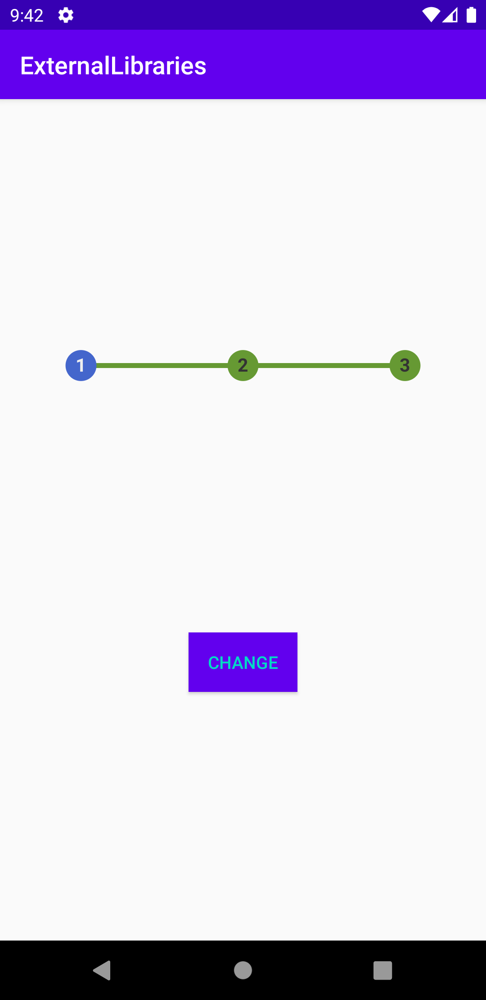
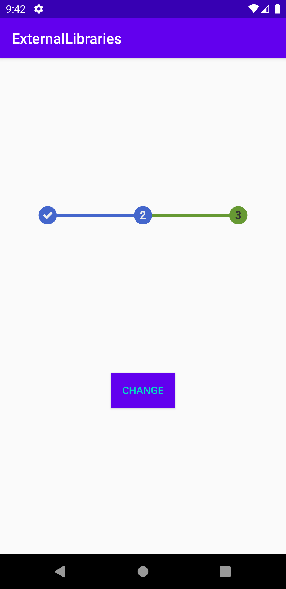

# Rapport
först implementerades det främmande biblioteket i build.gradle som dependencies för att kunna användas.
```
implementation 'com.kofigyan.stateprogressbar:stateprogressbar:1.0.0'
```
sedan skapades en widget av typen ``StateProgressBar`` med höjd, bredd, vilket nummer den är på, max antal nummer, färgen på backgrunds delen, färgen på det den är på eller har vart på,färgerna på nummrerna, en bock om den är klar med ett steg, och constraints. 
det skapades även en knapp.
```XML
    <com.kofigyan.stateprogressbar.StateProgressBar
        android:layout_width="wrap_content"
        android:layout_height="wrap_content"
        android:id="@+id/prog_bar"
        app:spb_currentStateNumber="one"
        app:spb_maxStateNumber="three"
        app:spb_stateBackgroundColor="#669933"
        app:spb_stateForegroundColor="#4466CC"
        app:spb_stateNumberBackgroundColor="#333333"
        app:spb_stateNumberForegroundColor="#eeeeee"
        app:spb_currentStateDescriptionColor="#009688"
        app:spb_stateDescriptionColor="#808080"
        app:spb_checkStateCompleted="true"
        app:layout_constraintTop_toTopOf="parent"
        app:layout_constraintBottom_toTopOf="@+id/change"
        app:layout_constraintEnd_toEndOf="parent"
        app:layout_constraintStart_toStartOf="parent"/>

    <Button
        android:layout_width="wrap_content"
        android:layout_height="wrap_content"
        android:text="Change"
        android:id="@+id/change"
        android:textColor="@color/colorAccent"
        android:background="@color/colorPrimary"
        app:layout_constraintBottom_toBottomOf="parent"
        app:layout_constraintEnd_toEndOf="parent"
        app:layout_constraintStart_toStartOf="parent"
        app:layout_constraintTop_toBottomOf="@+id/prog_bar"/>
```
efter det gavs de olika id för att kunna använda dem i java koden där knappen ges en onclicklistnener som ändrar progressbarens nummer till two.
```JAVA
public class MainActivity extends AppCompatActivity {

    @Override
    protected void onCreate(Bundle savedInstanceState) {
        super.onCreate(savedInstanceState);
        setContentView(R.layout.activity_main);
        final StateProgressBar progressBar = (StateProgressBar) findViewById(R.id.prog_bar);
        Button change = findViewById(R.id.change);
        change.setOnClickListener(new View.OnClickListener() {
            @Override
            public void onClick(View v) {
                progressBar.setCurrentStateNumber(StateProgressBar.StateNumber.TWO);
            }
        });

    }
}
```

innan knapptryck

efter knapptryck

